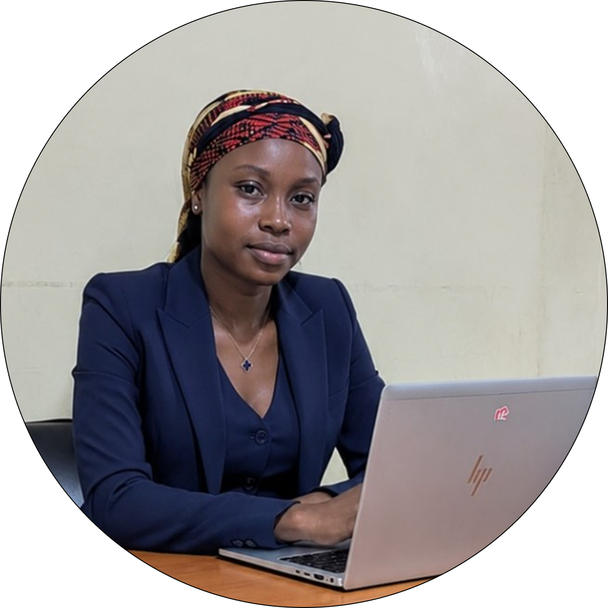

# 🧼 Bidè – Gestion Lavage

Plateforme de gestion complète pour le lavage automobile **"Bidè"** – AKIMMAKO, Lomé, Togo.

> **Projet pédagogique** réalisé par une équipe de 4 étudiants en développement, dans le cadre de la formation **ADN Golfe 1 – Académie Digitale Numérique** (Août 2026).  
> Back-office 14 pages, front-office vitrine, déploiement sur Vercel.

---
<br>

## 🚀 Liens vers les plateformes en ligne

| Plateforme | Lien |
|------------|------|
| **Plateforme de gestion (Back-office)** | [https://gestion-orpin-zeta.vercel.app/](https://gestion-orpin-zeta.vercel.app/) |
| **Site vitrine (Front-office)** | [https://site-vitrine-alpha-lyart.vercel.app/](https://site-vitrine-alpha-lyart.vercel.app/) |
| **Dépôt GitHub** | [https://github.com/justinadukpo92-boop/GESTION_DE_LAVAGE](https://github.com/justinadukpo92-boop/GESTION_DE_LAVAGE) |

---
<br>

## ✨ Fonctionnalités principales

- **Authentification** : Page de connexion sécurisée (simulée).
- **Dashboard** : Vue d'ensemble (CA, véhicules, prestations en cours, commandes).
- **Gestion des clients** : Liste, recherche, ajout/modification.
- **Gestion des véhicules** : Liste, recherche, ajout/modification.
- **Catalogue des prestations** : Consultation des services.
- **Nouvelle commande** : Formulaire multi-étapes (client, services, planning, résumé).
- **Historique des commandes** : Filtres, accès au détail et facture.
- **Espace Admin** : Gestion des prestations (CRUD) et FAQ.
- **Statistiques** : Graphiques (CA, répartition, commandes par jour).
- **Paramètres** : Configuration entreprise (nom, TVA, logo).

---
<br>

## 🛠️ Technologies utilisées

| Technologie | Utilisation |
|-------------|-------------|
| **HTML5 / CSS3** | Structure et mise en forme |
| **Bootstrap 5** | Framework responsive et composants UI |
| **JavaScript** | Interactivité, graphiques Canvas, logique métier |
| **Git / GitHub** | Versionnement et collaboration |
| **Vercel** | Hébergement et déploiement continu |

---
<br>

## 📁 Structure du projet

GESTION_DE_LAVAGE/<br>
├── Gestion/# Plateforme de gestion (back-office)<br>
│ ├── index.html # Page de connexion<br>
│ ├── dashbord.html # Tableau de bord<br>
│ ├── listedesclients.html<br>
│ ├── formulaireclient.html<br>
│ ├── listedesvehicules.html<br>
│ ├── formulairevehicule.html<br>
│ ├── cataloguedesprestations.html<br>
│ ├── gestiondesprestations.html<br>
│ ├── nouvellecommande.html<br>
│ ├── listedescommandes.html<br>
│ ├── detailcommandefacture.html<br>
│ ├── parametres.html<br>
│ ├── statistiques.html<br>
│ ├── faq.html<br>
│ ├── css/<br>
│ │ └── style.css<br>
│ ├── js/<br>
│ │ └── script.js<br>
│ └── images/<br>
│ ├── logo-bide.png<br>
│ └── equipe/ # Photos de l'équipe<br>
│ ├── paola.jpg<br>
│ ├── merveil.jpg<br>
│ ├── felix.jpg<br>
│ ├── kodzovi.jpg<br>
│ └── formateur.jpg<br>
├── site-vitrine/ # Site public (front-office)<br>
└── README.md # Ce fichier<br>


---
<br>

## 🧪 Installation et test en local

1. Cloner le dépôt :
   ```bash
   git clone https://github.com/justinadukpo92-boop/GESTION_DE_LAVAGE.git
   cd GESTION_DE_LAVAGE

2. Ouvrir Gestion/index.html dans votre navigateur.

<br><br>

## 🧪 Equipe Projet

 <strong>Photo - Nom - Rôle<strong>
<br><br>

	GBEDEMAH Paola,	Etudiante en developpement web et web mobile<br><br>

	KOWOU Sanvi Merveil,	Etudiant en developpement web et web mobile<br><br>

	ADIGOU Adélodjou Félix,	Etudiant en developpement web et web mobile<br><br>

	ADUKPO Kodzovi,	Scrum Master / Lead Dev / Etudiant en developpement web et web mobile<br><br>

## ENCADREMENT
	Abdou-Akim GBADAMASSI	Formateur référent, Ambassadeur 10 000 Codeurs 
<br><br><br><br>


## 📄 Livrables

✅ Dépôt GitHub (code source complet)

✅ Plateforme déployée sur Vercel (gestion + vitrine)

✅ Cahier des charges intégrant le TDR (hors GitHub)

✅ README complet

✅ Historique Git visible (branches, commits, PR)

## 🙏 Remerciements 
Merci à notre formateur, Abdou-Akim GBADAMASSI, pour son encadrement et ses conseils tout au long du projet, ainsi qu'à toute l'équipe pour son engagement et sa bonne humeur.